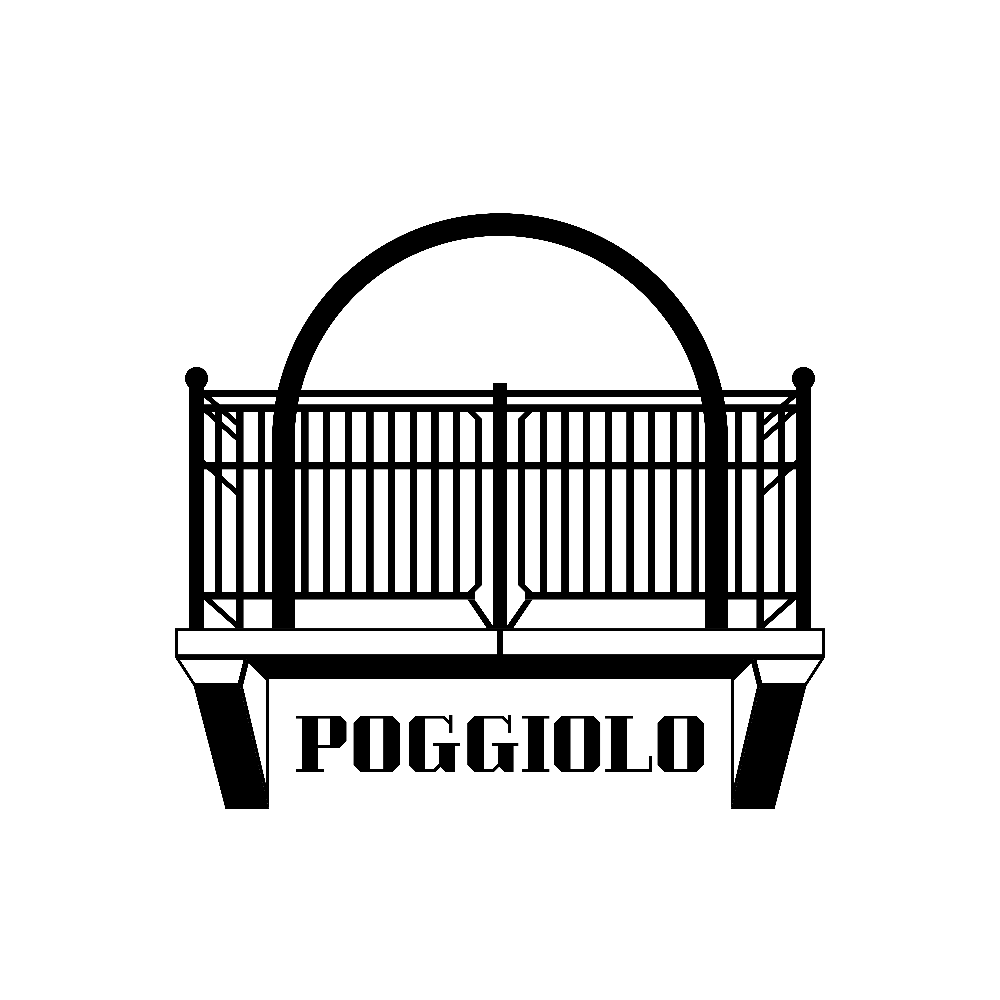
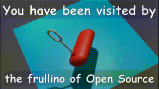

  

  <h1>POGGIOLO BRANDING MATERIAL</h1>

  <h2>Frullino of Open Source</h2>

For when you feel like you need more open source in your life remember the frullino of open source. Add it to your projects, it will protect them.

Find the files in  `frullino/`.

  

